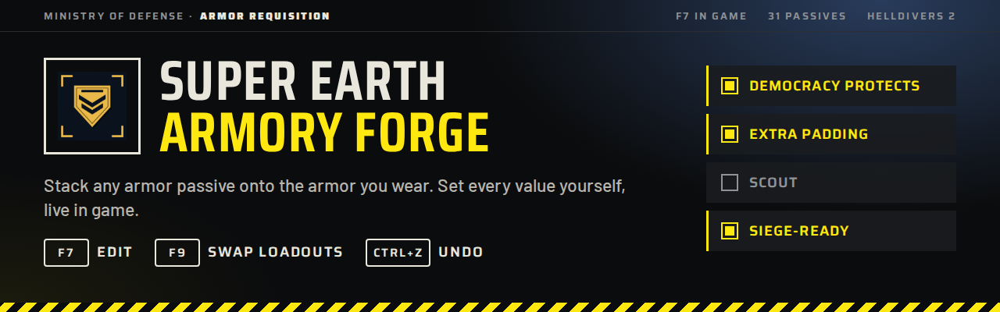
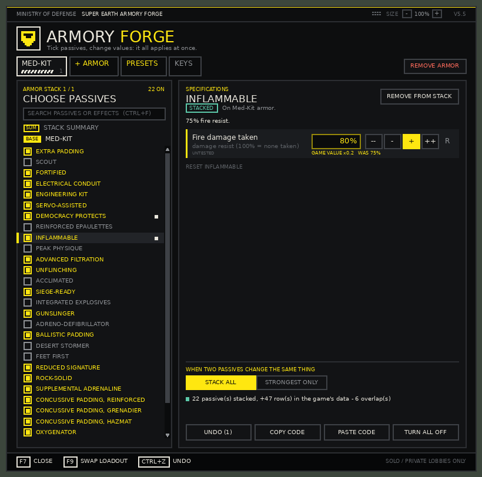
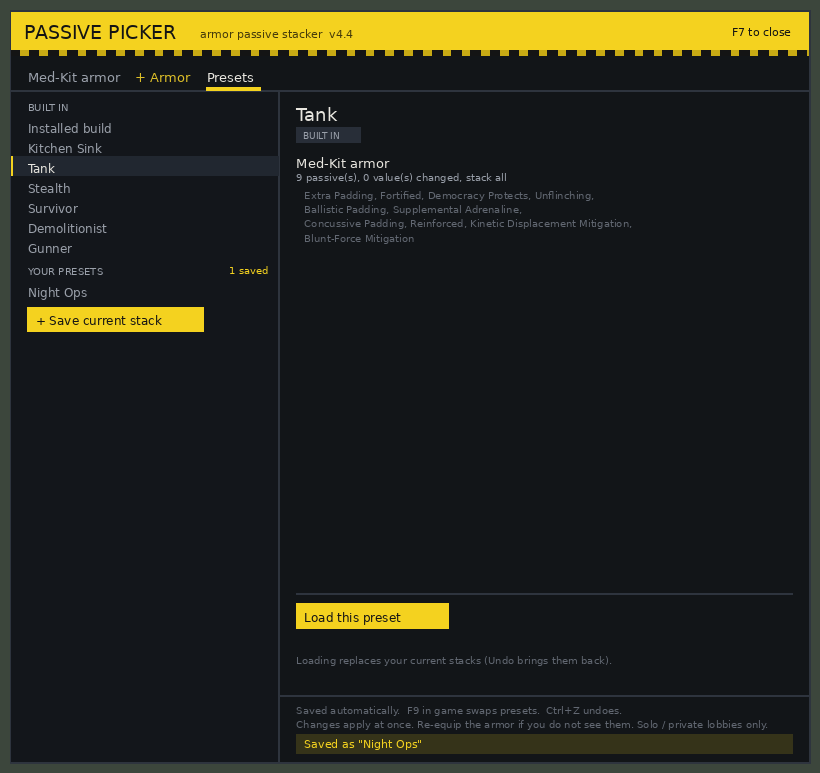
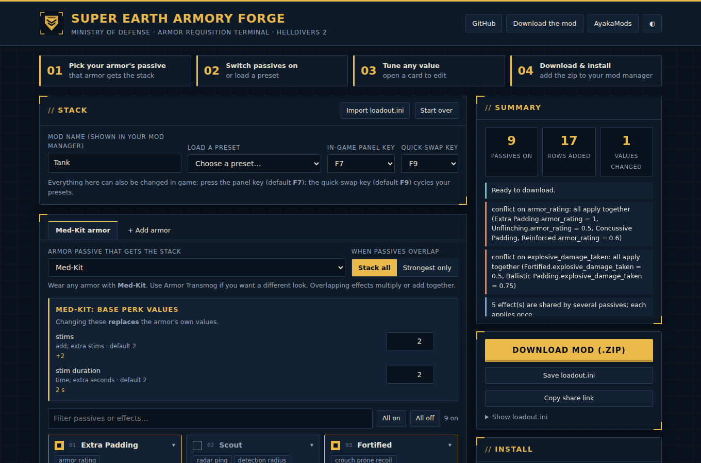

<p align="center"></p>

<p align="center">
<a href="https://github.com/Hung1510/Super-Earth-Armory-Forge/actions/workflows/tests.yml"></a>
<a href="https://github.com/Hung1510/Super-Earth-Armory-Forge/releases/latest"></a>
<a href="https://ayakamods.com/mods/super-earth-armory-forge.4359/"></a>
<a href="https://ayakamods.com/mods/super-earth-armory-forge.4359/"></a>
<a href="https://ayakamods.com/mods/super-earth-armory-forge.4359/"></a>
<a href="https://www.nexusmods.com/helldivers2/mods/16763"></a>
<a href="https://github.com/Hung1510/Super-Earth-Armory-Forge/releases"></a>
<a href="TESTING.md"></a>
</p>

**Install it, then press <kbd>F7</kbd> in game.** Tick passives, type values like `75%` or `+50 armor`, save loadouts and swap them with <kbd>F9</kbd>. Everything applies at once. Prefer to plan ahead? Use the **[web builder](https://hung1510.github.io/Super-Earth-Armory-Forge/)**.

<table>
<tr>
<td width="33%"><br><sub><b>F7 in game.</b> Tick passives, edit values live.</sub></td>
<td width="33%"><br><sub><b>Presets.</b> Standard loadouts and your own; <kbd>F9</kbd> swaps them.</sub></td>
<td width="33%"><br><sub><b>Web builder.</b> Optional: plan a build in the browser.</sub></td>
</tr>
</table>

Armory Forge started as an edit of **[Modular Armor Passives / Passive Picker v3](https://ayakamods.com/mods/modular-armor-passives.4350/) by mostlycloudy**, and its memory-patching core, archive format and passive data still come from that mod (engine credit also to SHODAN). The in-game terminal, loadouts, config layer and web builder are Armory Forge's own. See [CREDITS.txt](CREDITS.txt).

- **Requires:** [Bingus Shared Loader](https://ayakamods.com/mods/bingus-shared-loader.3861/)
- **Single-player / private lobbies only.** Don't use it in public matchmaking.
- Download: [Nexus Mods](https://www.nexusmods.com/helldivers2/mods/16763) · [AyakaMods](https://ayakamods.com/mods/super-earth-armory-forge.4359/) · [GitHub Releases](https://github.com/Hung1510/Super-Earth-Armory-Forge/releases/latest)

## Ways to use it

| You want | Do this |
|---|---|
| Build in game (most people) | Download **[Super-Earth-Armory-Forge.zip](https://github.com/Hung1510/Super-Earth-Armory-Forge/releases/latest)**, add it to your mod manager (there are no options to pick), start the game, press **F7** |
| A ready-made build | Same zip, then F7, then **Presets**: *Kitchen Sink, Tank, Stealth, Survivor, Demolitionist, Gunner* |
| Plan a build before playing | **[Web builder](https://hung1510.github.io/Super-Earth-Armory-Forge/)**, then *Download mod (.zip)* |
| Scripting / version control | `python tools\picker.py build loadout.ini --zip "My Stack.zip"` (below) |

Then:
1. Remove Passive Picker v3 if you have it. Passive Picker v4 is this mod under its old name; the update replaces it and keeps your saved builds.
2. Deploy, **fully restart the game**, and wear armor with the passive your stack is on (for example Med-Kit; use Armor Transmog if you want a different look).
3. Check `%LOCALAPPDATA%\CowboyBingus\Helldivers2\Logs\ArmoryForge-STATUS.txt`. It should say `OK - perk stacked` once something is stacked; a fresh install shows a *Press F7* card when the game is ready.

## The armory terminal (F7)

- **Left:** every armor passive with a tick box. Ticked = stacked onto your armor. Click a name to see its values.
- **Right:** the chosen passive's values, in plain terms (`75%` resist, `+30%`, `+50` armor). `--` `-` `+` `++` change them, `R` resets, or click a value and type one, e.g. `75` for 75% (Enter to set, Esc to cancel). The armor's own passive (e.g. Med-Kit) is listed first; its values **replace** the originals.
- **Tabs:** one per armor passive you stack onto. **+ Armor** adds another (e.g. a separate Siege-Ready stack), **Remove this armor** puts the game's own values back.
- **When two passives change the same thing:** *Stack all* or *Strongest only*.
- Every change applies at once and is saved to `%LOCALAPPDATA%\CowboyBingus\Helldivers2\ArmoryForge\loadout.ini`, the same format as the web builder, so you can import it there to share. Installing a web-builder build starts fresh from that build; the release zip always keeps what you made.
- **Presets tab:** load a standard preset or one of yours. **+ Save current stack** saves what you have; rename, overwrite or delete your own. Saved in `ArmoryForge\my-presets.txt`.
- **Quick-swap (F9):** cycles your presets in game without opening the panel (built-ins if you have none saved). Set `swap_hotkey = F9` or `OFF` in `[settings]`.
- **Undo / Ctrl+Z** takes back the last change (up to 30).
- **Panel size:** `[-] 100% [+]` at the top, or **Ctrl +** / **Ctrl -** (Ctrl 0 resets), 80 to 150%. Also `panel_scale = 1.2` in `[settings]`.
- **Copy code / Paste code:** your build as one line of text for Discord etc. Web-builder share links paste too.
- The key is set with `hotkey = F7` in `[settings]` (the web builder has a dropdown). SHODAN Stat Editor uses F8, and its panel sits on the right while this one sits on the left.
- If a change doesn't show, re-equip the armor or start a mission.


## What Armory Forge adds over Passive Picker v3

| Passive Picker v3 | Armory Forge |
|---|---|
| comment out hex rows in a 1,000-line Lua | web builder, or `Democracy Protects = on` in `loadout.ini` |
| one trigger armor | one stack per armor passive, several at once |
| base perk can't be changed | `Med-Kit.stims = 6` **replaces** the base value |
| hex values | named effects: `Democracy Protects.death_save = 2.0` |
| conflicts always multiply | `conflicts = stack` or `strongest` |
| rebuild and reinstall for every change | F7 in-game panel, live |
| one build per zip | one install; loadouts saved, loaded and swapped (F9) in game |
| raw game numbers | plain values: `75%` resist, `+30%`, `+50` armor |

## What's confirmed in game

Effect names are **inferred** from the passive descriptions; the game only stores hashes. The mod itself is confirmed to load and patch in game. Most individual effects are still **untested**. See **[TESTING.md](TESTING.md)** for the status of each one and how to test it. Report results with an [Effect test result](https://github.com/Hung1510/Super-Earth-Armory-Forge/issues/new?template=effect_report.yml) issue.

Known limits:
- `death_save = 2.0` = 100% is a best guess.
- Adreno-Defibrillator's revive is probably tied to the perk ID, so it likely won't work when stacked.
- Some passives store their effect in both lists (Epaulettes, Unflinching, Siege-Ready, Gunslinger, Hazmat, True Grit): a normal effect and a `(stat)` effect. Change both.

## Command line (Python 3.8+)

```powershell
git clone https://github.com/Hung1510/Super-Earth-Armory-Forge.git
cd Super-Earth-Armory-Forge
pip install lupa                                   # optional: Lua syntax check

python tools\picker.py list                        # every passive, effect, default
python tools\picker.py build loadout.ini           # preview
python tools\picker.py build loadout.ini --zip "My Stack.zip"
python tools\picker.py release --zip dist\Super-Earth-Armory-Forge.zip   # the release zip
```

The web builder can import and export the same `loadout.ini`.

```ini
[settings]
name   = My Stack
retire = true                    ; false = re-check every 5s

[profile: Med-Kit]               ; armor that HAS Med-Kit gets this stack
conflicts = stack                ; or: strongest
Democracy Protects = on
Siege-Ready        = on
Med-Kit.stims                    = 6      ; replaces the base +2
Democracy Protects.death_save    = 2.0
Siege-Ready.ammo_capacity        = 1.5    ; both-list passives: set both lines
Siege-Ready.stat_ammo_capacity   = 1.5

[profile: Siege-Ready]           ; a second, independent stack
Scout = on
```

Advanced: `raw = 0xHEXID type value, ...` and `raw_stats = stat unk1 unk2, ...` append arbitrary rows. Types are 0 set, 1 add, 2 multiply, 3 time.

## Project layout

```
tools/picker.py            catalog, config parser, Lua generator, .patch_0 + zip writer, CLI
tools/engine.lua           runtime engine: finds the perk records, applies/restores stacks, loadout file
tools/panel.lua            the F7 in-game panel (drawing, mouse, keyboard)
tools/main.lua             per-frame tick and startup
docs/                      web builder (GitHub Pages): index.html, app.js (UI), core.js (build logic)
docs/data.json             generated by `picker.py export-web`, never hand-edited
presets/*.ini              the standard presets (Presets tab, F9)
tests/harness.py           fake game for LuaJIT: memory, engine GUI, keyboard, mouse
tests/test_ingame.py       real mod vs fake game: rows match picker.py, panel flows, save/restore
tests/test_panel_features.py  presets, quick-swap, undo, share codes, plain values
tests/test_release.py      release zip, blank install, saves from before the rename
tests/test_panel_layout.py no overlapping or clipped text in any panel view, 720p to 4K
tests/test_panel_scale.py  panel size setting, Ctrl +/-, whole-pixel drawing
tests/test_web_parity.js   web builder output must be byte-identical to Python
tools/ayakamods_stats.py   AyakaMods download/view badges (workflow, every 6 h)
TESTING.md                 in-game verification status per effect
```

## When the game updates

Nothing to do for new armor that uses an existing passive; stacks are per passive, not per armor.

On patch day:
1. Start the game once with the mod. Check `ArmoryForge-STATUS.txt`:
   - `found=31 of 31`: all good.
   - `NOT in the catalog=N`: new passives exist.
   - `found=0`: the game's data layout changed. The mod safely does nothing; disable it until it's updated.
2. The mod has written every armor passive the game has, with the game's own values, to `%LOCALAPPDATA%\CowboyBingus\Helldivers2\ArmoryForge\passives-dump.txt`. Compare it with the catalog:
   ```
   python tools\picker.py check-dump
   ```
   It prints **NEW** passives and **CHANGED** values as ready-to-paste `CATALOG` lines, **MISSING** passives, and new effect IDs for `EFFECTS`. It exits 0 when nothing changed.
3. Paste the lines into `tools/picker.py`, give new passives and effects real names, then run `python tools\picker.py export-web` and `python tests\test_ingame.py`. Commit, tag and release.

## Contributing

- **Effect name confirmed or wrong:** edit `EFFECTS` / `STAT_EFFECTS` in `tools/picker.py`, update `TESTING.md`, run `python tools/picker.py export-web`.
- **New passive after a game patch:** add it to `CATALOG` in `tools/picker.py`, then run `export-web`.
- **New preset:** add `presets/NN-name.ini`, then run `export-web`.
- **Web UI:** `docs/app.js` / `docs/index.html`. Build logic belongs in `docs/core.js`, and it must stay a port of `picker.py`.
- Before a PR (CI runs the same checks):
  ```
  pip install lupa
  python tools/picker.py export-web --check
  python tests/test_ingame.py
  python tests/test_panel_features.py
  python tests/test_release.py
  python tests/test_panel_layout.py
  python tests/test_panel_scale.py
  node tests/test_web_parity.js
  ```
  Preview the site locally with `cd docs && python -m http.server`.
- **Releasing:** bump `VERSION` in `tools/picker.py` and add a `CHANGELOG.md` entry. Then run `export-web`, commit, and push a tag (`git tag v5.0 && git push origin v5.0`). GitHub Actions builds the zip and attaches it to the release.

## Credits

- **mostlycloudy**: Passive Picker v3, where this started: memory-patching engine, archive format, passive data ([AyakaMods](https://ayakamods.com/mods/modular-armor-passives.4350/))
- **SHODAN**: engine credit, as noted in v3; the panel's drawing, input and font handling are adapted from [SHODAN Stat Editor](https://github.com/SHODAN-HORAI/SHODAN-Stat-Editor) v1.4.1 (public domain)
- **Bingus Shared Loader**: the loader this runs on
- **JSZip** (MIT): zip writing in the web builder
- **Hung1510**: Super Earth Armory Forge: armory terminal, loadouts, config layer, web builder

Not affiliated with Arrowhead Game Studios.
