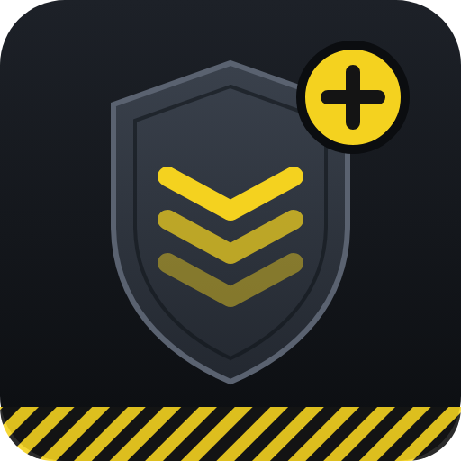

<p align="center"></p>

# Passive Picker v4: HD2 armor passive stacker

[](https://github.com/Hung1510/HD2-Armor-Transmog/actions/workflows/tests.yml)
[](https://github.com/Hung1510/HD2-Armor-Transmog/releases/latest)

Stack any of the 31 Helldivers 2 armor passives onto your armor and tune every value.

**[Open the web builder](https://hung1510.github.io/HD2-Armor-Transmog/)**: tick passives, drag values, download a ready-to-install zip. No Python, nothing to install.

Built on **[Modular Armor Passives / Passive Picker v3](https://ayakamods.com/mods/modular-armor-passives.4350/) by mostlycloudy**. The memory-patching engine, archive format and passive data are mostlycloudy's work (engine credit also to SHODAN); v4 adds the config layer, presets and builder. See [CREDITS.txt](CREDITS.txt).

- **Requires:** [Bingus Shared Loader](https://ayakamods.com/mods/bingus-shared-loader.3861/)
- **Single-player / private lobbies only.** Don't use it in public matchmaking.
- AyakaMods page: *(link here once posted)*

## Three ways to use it

| You want | Do this |
|---|---|
| A ready-made build | Download **[Passive-Picker-v4.zip](https://github.com/Hung1510/HD2-Armor-Transmog/releases/latest)**, add it to your mod manager, pick a preset: *Kitchen Sink, Tank, Stealth, Survivor, Demolitionist, Gunner* |
| Your own build, no setup | **[Web builder](https://hung1510.github.io/HD2-Armor-Transmog/)**, then *Download mod (.zip)* |
| Scripting / version control | `python tools\picker.py build loadout.ini --zip "My Stack.zip"` (below) |

Then:
1. Remove Passive Picker v3 and any older v4 build.
2. Deploy, **fully restart the game**, and wear armor with the passive the stack is on (Med-Kit by default; use Armor Transmog if you want a different look).
3. Check `%LOCALAPPDATA%\CowboyBingus\Helldivers2\Logs\PassivePickerV4-STATUS.txt`. It should say `OK - perk stacked`.

## What v4 adds over v3

| v3 | v4 |
|---|---|
| comment out hex rows in a 1,000-line Lua | web builder, or `Democracy Protects = on` in `loadout.ini` |
| one trigger armor | one stack per armor passive, several at once |
| base perk can't be changed | `Med-Kit.stims = 6` **replaces** the base value |
| hex values | named effects: `Democracy Protects.death_save = 2.0` |
| conflicts always multiply | `conflicts = stack` or `strongest` |
| one build per zip | six presets in one zip, chosen in the mod manager |

## What's confirmed in game

Effect names are **inferred** from the passive descriptions; the game only stores hashes. The mod itself is confirmed to load and patch in game. Most individual effects are still **untested**. See **[TESTING.md](TESTING.md)** for the status of each one and how to test it. Report results with an [Effect test result](https://github.com/Hung1510/HD2-Armor-Transmog/issues/new?template=effect_report.yml) issue.

Known limits:
- `death_save = 2.0` = 100% is a best guess.
- Adreno-Defibrillator's revive is probably tied to the perk ID, so it likely won't work when stacked.
- Some passives store their effect in both lists (Epaulettes, Unflinching, Siege-Ready, Gunslinger, Hazmat, True Grit): a normal effect and a `(stat)` effect. Change both.

## Command line (Python 3.8+)

```powershell
git clone https://github.com/Hung1510/HD2-Armor-Transmog.git
cd HD2-Armor-Transmog
pip install lupa                                   # optional: Lua syntax check

python tools\picker.py list                        # every passive, effect, default
python tools\picker.py build loadout.ini           # preview
python tools\picker.py build loadout.ini --zip "My Stack.zip"
python tools\picker.py release --zip dist\Passive-Picker-v4.zip   # presets zip
```

The web builder can import and export the same `loadout.ini`.

```ini
[settings]
name   = My Stack
retire = true                    ; false = re-check every 5s

[profile: Med-Kit]               ; armor that HAS Med-Kit gets this stack
conflicts = stack                ; or: strongest
Democracy Protects = on
Siege-Ready        = on
Med-Kit.stims                    = 6      ; replaces the base +2
Democracy Protects.death_save    = 2.0
Siege-Ready.ammo_capacity        = 1.5    ; both-list passives: set both lines
Siege-Ready.stat_ammo_capacity   = 1.5

[profile: Siege-Ready]           ; a second, independent stack
Scout = on
```

Advanced: `raw = 0xHEXID type value, ...` and `raw_stats = stat unk1 unk2, ...` append arbitrary rows. Types are 0 set, 1 add, 2 multiply, 3 time.

## Project layout

```
tools/picker.py            catalog, config parser, Lua generator, .patch_0 + zip writer, CLI
tools/engine.lua           runtime engine (mostlycloudy's v3 engine + v4 profiles/overrides)
docs/                      web builder (GitHub Pages): index.html, app.js (UI), core.js (build logic)
docs/data.json             generated by `picker.py export-web`, never hand-edited
presets/*.ini              the presets shipped in the release zip
tests/test_engine.py       runs the real engine in LuaJIT against a fake perk table
tests/test_web_parity.js   web builder output must be byte-identical to Python
TESTING.md                 in-game verification status per effect
```

## Contributing

- **Effect name confirmed or wrong:** edit `EFFECTS` / `STAT_EFFECTS` in `tools/picker.py`, update `TESTING.md`, run `python tools/picker.py export-web`.
- **New passive after a game patch:** add it to `CATALOG` in `tools/picker.py`, then run `export-web`.
- **New preset:** add `presets/NN-name.ini`, then run `export-web`.
- **Web UI:** `docs/app.js` / `docs/index.html`. Build logic belongs in `docs/core.js`, and it must stay a port of `picker.py`.
- Before a PR (CI runs the same checks):
  ```
  pip install lupa
  python tools/picker.py export-web --check
  python tools/picker.py build examples/two-profiles.ini --dump-lua build/test.lua
  python tests/test_engine.py build/test.lua
  node tests/test_web_parity.js
  ```
  Preview the site locally with `cd docs && python -m http.server`.
- **Releasing:** bump `VERSION` in `tools/picker.py` and add a `CHANGELOG.md` entry. Then run `export-web`, commit, and push a tag (`git tag v4.2 && git push --tags`). GitHub Actions builds the presets zip and attaches it to the release.

## Credits

- **mostlycloudy**: original mod, engine, passive data ([AyakaMods](https://ayakamods.com/mods/modular-armor-passives.4350/))
- **SHODAN**: engine credit, as noted in v3
- **Bingus Shared Loader**: the loader this runs on
- **JSZip** (MIT): zip writing in the web builder
- **Hung1510**: v4 config layer, presets, web builder

Not affiliated with Arrowhead Game Studios.
