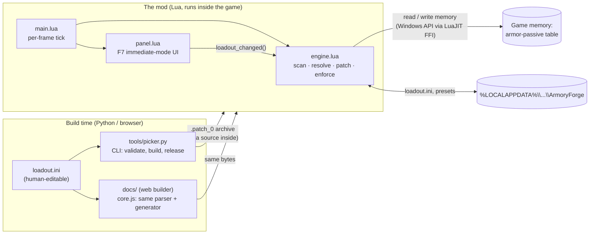

# Architecture

Super Earth Armory Forge changes which armor passives Helldivers 2 applies, **live, in the running
game**. It does this without touching a game file. It finds the game's armor-passive table in
memory and redirects the modifier arrays of the records it changes to copies it builds, and it can
put every byte back. This document covers how that works, how it stays safe, and how it is tested
without the game.

- [The pieces](#the-pieces)
- [The engine: patching a live game record](#the-engine-patching-a-live-game-record)
- [Safety rules](#safety-rules)
- [One loadout format, three implementations](#one-loadout-format-three-implementations)
- [The in-game panel](#the-in-game-panel)
- [Two editions from one codebase](#two-editions-from-one-codebase)
- [Testing without the game](#testing-without-the-game)
- [Build and release](#build-and-release)

## The pieces



| Part | Language | Role |
|---|---|---|
| `tools/engine.lua` | Lua (LuaJIT) | Finds the armor-passive records in memory, resolves the loadout into modifier rows, patches and restores records, re-applies them when the game reloads its data |
| `tools/panel.lua` | Lua (LuaJIT) | The F7 in-game editor: immediate-mode drawing on the engine's GUI, mouse and keyboard through the Windows API, presets, undo, keys, search |
| `tools/main.lua` | Lua | Startup and the per-frame tick: scan budget, phases, autosave, panel |
| `tools/picker.py` | Python | Catalog of every passive and effect, the `.ini` parser, the Lua generator, the `.patch_0` archive writer, release builds |
| `docs/core.js`, `docs/app.js` | JavaScript | The web builder: the same parser and generator as `picker.py`, running in the browser |
| `tests/` | Python + Node | A fake game for the real mod code, layout checks with real font metrics, parity, release checks |

The mod is loaded by Bingus Shared Loader. The generated Lua carries a `MOD` table (edition, keys,
built-in presets, catalog) followed by the engine, panel and main sources.

## The engine: patching a live game record

The game keeps its settings tables in memory as **LDLD blocks** (a 24-byte header: `"LDLD"`,
version `1`, a type hash, the payload size). The armor passives are type `0x63CE0FEB`
(`HelldiverCustomizationPassiveBonusSettings`). Each record looks like this:

```
+0   u32      perk id                (7 = Med-Kit, 16 = Siege-Ready, ...)
+16  DLArray  PassiveModifiers       (u64 pointer, u64 count)  -> 16-byte rows: id, type, value, text hash
+32  DLArray  StatModifiers          (u64 pointer, u64 count)  -> 12-byte rows: stat, a, b
+56  inline rows, as shipped
```

A passive's gameplay effect is its list of rows. So instead of overwriting values in place, the
engine **builds a new row array and points the record's `DLArray` at it**:

```mermaid
sequenceDiagram
    participant T as main.lua tick
    participant E as engine
    participant M as game memory
    T->>E: scan_step() (time-boxed, 1.5-4 ms/frame)
    E->>M: read memory regions in 256 KB chunks
    E->>E: byte loop finds "LDLD" + version 1 headers
    E->>M: read block, check type 0x63CE0FEB
    E->>E: capture(): snapshot both descriptors + inline row counts
    Note over E: record already points elsewhere? -> "foreign", leave it alone
    E->>E: resolve_profile(): loadout -> rows to add, values to override
    E->>E: desired(): inline rows + overrides + new rows (deduplicated)
    E->>M: write rows into the spare one of two buffers, read back
    E->>M: ONE 16-byte store: pointer + count
    E->>M: read descriptor back; mismatch -> restore the old one
```

Key points:

- **Scanning is budgeted.** Each frame gets a measured share of the frame time (about 3 ms at
  60 fps, at most 4 ms). The byte loop reuses one FFI buffer and allocates nothing, so LuaJIT
  compiles it. Once the first passive block is found, the scan narrows to a 4 MB window around it
  and stops when every known passive is in.
- **Rebuilt from the source every time.** Each apply re-reads the record's own inline rows and
  rebuilds the array from them. Turning a passive off restores the original descriptor byte for
  byte. Values that other mods edit in place (e.g. SHODAN Stat Editor) are kept.
- **Enforced.** Every 5 s the engine checks that its records are intact. If the game reloaded the
  table (new mission, new memory), it scans again and re-applies. If something overwrote a
  descriptor, it puts its own back.
- **After a game patch**, the engine writes `passives-dump.txt` (every passive as the game ships
  it), and `picker.py check-dump` turns the differences into ready-to-paste catalog lines.

## Safety rules

The mod writes into another program's live memory, so every write follows the same rules:

1. **Atomic switch.** Pointer and count are written as one 16-byte store, so the game can never
   see a new pointer with an old count.
2. **Double buffering.** Each record has two buffers. New rows go into the one the game is *not*
   reading; only then is the descriptor switched. The game never reads a half-written array.
3. **Verify or roll back.** Every buffer write and descriptor write is read back. If the descriptor
   doesn't match, the previous one is restored.
4. **Never fight another mod.** A record whose arrays don't point at their own inline rows belongs
   to someone else and is left alone (reported in the panel and the log).
5. **Game files are never touched.** Everything lives in memory and disappears when the game closes.
6. **Fail closed.** Every frame's work runs under `pcall`. The panel closes itself after five errors
   in a row, and the scan gives up with a status line instead of crashing the game.

## One loadout format, three implementations

A build is a plain `loadout.ini`:

```ini
[settings]
hotkey = F7

[profile: Med-Kit]
conflicts = stack
Siege-Ready = on
Med-Kit.stims = 6
```

It is parsed in three places: `picker.py` (CLI), `core.js` (web builder) and `engine.lua` (the
panel's saves and presets). Two rules keep them in agreement:

- **Byte-identical output.** `tests/test_web_parity.js` feeds the same `.ini` files to Python and
  JavaScript and requires the generated Lua, and the zipped `.patch_0` archive, to be the same
  bytes.
- **The engine resolves at runtime.** Build tools only *store* the loadout. Turning it into modifier
  rows (merge order, overlap policy, value overrides) happens once, in `engine.lua`, so what the
  panel shows is exactly what the game gets.

Saves keep working across versions. The built-in loadout is fingerprinted (djb2 over its canonical
text), and settings added later (`swap_hotkey`, `panel_scale`) and the old header text are left out
of the hash. So a rename or a new setting never throws away what someone built in the panel.
`tests/fixtures/save-4.4-kitchen-sink.ini` pins this.

## The in-game panel

The panel is an **immediate-mode UI** drawn with the engine's GUI (`Gui.rect`, `Gui.text`):

- **Redrawn on change only.** Each frame builds a signature (resolution, hover, view, a version
  counter). The GUI is rebuilt only when it changes, so an idle panel costs almost nothing.
- **Click regions come out of drawing.** Every button records a `region` while it is drawn. Hit-testing
  walks them last to first, so what is on top gets the click. Tests use the same regions to click
  buttons by name.
- **Sharp at any size.** Layout is in panel units (1000 × 990) scaled to the screen. Every edge,
  text position and font size is rounded to a whole pixel, and text that would overflow shrinks
  one whole pixel at a time. Text width is measured by the engine when possible, else estimated
  per character on the wide side.
- **Input** comes through the Windows API (`GetAsyncKeyState`, `GetCursorPos`, clipboard) over
  LuaJIT FFI, with key repeat, focus checks, and freeing and restoring the game's cursor.
- Features: presets and quick-swap (F9), undo (30 steps), share codes, typed values in plain units
  (`75%` resist, `+50` armor), scrolling lists, drag to move, size 80–150 %, a Keys tab, search.

Lua allows 200 local variables per function, and the engine uses most of the main chunk's. So the
panel lives inside one builder function and keeps its helpers in tables (`ui`, `PP`).

## Two editions from one codebase

| | Full edition | Passive Swap edition |
|---|---|---|
| Built with | `picker.py release` | `picker.py release --edition swap` |
| Published on | GitHub, AyakaMods | Nexus Mods |
| Stacking | any number of passives per armor | no: one passive per armor |
| Values | editable | the game's own, copied from its record |
| Saves | `loadout.ini`, `my-presets.txt` | `loadout-swap.ini`, `my-swaps.txt` |

The swap edition's limit is enforced **in the engine**, not only in the UI. With `MOD.swap_only` set,
`resolve_profile()` ignores everything except the one `swap` passive, and `desired()` copies
that passive's rows straight from its own game record. A hand-edited save, preset or share code
therefore can't stack or boost anything. `tests/test_swap_edition.py` tries exactly that with a
hostile save file.

## Testing without the game

The mod runs inside a game that can't be automated, so the tests bring a **fake game** instead
(`tests/harness.py`):

- **The real mod code, under LuaJIT.** The generated Lua (engine, panel, main) runs unmodified in
  LuaJIT through `lupa`. Only the edges are fakes: memory reads and writes, allocation, region
  listing, the GUI, the mouse and keyboard, the clock and the file system.
- **Fake memory laid out like the game's.** One LDLD block per passive, with the real 56-byte
  record and inline rows, so the scanner, the snapshot and the byte-for-byte restore are tested
  against the same layout the game uses.
- **Driven like a player.** Tests press keys, move the mouse, click regions by name, type text and
  drag the panel, then check both the UI (texts, regions) and the game's memory (rows, stats,
  pristine bytes).
- **Layout checks with real fonts.** Text is measured with a real TrueType font (Pillow). Every view
  is checked at 720p, 1080p, 1440p, 4K and at 80–150 % size for overlapping text, labels that run
  out of their buttons, and non-whole-pixel drawing. The same harness renders the screenshots used
  in the README.

```
python tests/run_all.py
```

| Suite | Checks |
|---|---|
| `test_ingame.py` | scan, apply, restore, re-apply after the game reloads, other mods' records left alone |
| `test_panel_features.py` | presets, quick-swap, undo, share codes, plain-unit values |
| `test_panel_layout.py` | every view at every resolution and size: no overlaps, no clipping, whole pixels |
| `test_panel_scale.py` | panel size setting and keys, fits the screen |
| `test_panel_scroll_drag.py` | every passive reachable by scrolling; dragging, clamping, saved position |
| `test_panel_keys_search.py` | Keys tab, fallback for bad keys, search by name and effect |
| `test_swap_edition.py` | swap copies the game's record exactly; can't be pushed past vanilla |
| `test_release.py` | both zips: contents, manifests, no scripts, old saves still load |
| `test_web_parity.js` | Python and JavaScript produce identical Lua and archives |

## Build and release

- **CI** (`.github/workflows/tests.yml`): ruff lint, both editions compile, every preset builds,
  the web builder's data is in sync with `tools/`, then every suite.
- **Release** (`.github/workflows/release.yml`): pushing a tag like `v5.4` runs every test, builds
  both editions, writes the release notes from `CHANGELOG.md` (`tools/release_notes.py`) and publishes
  the GitHub release with both zips.
- **Release zips are allow-listed.** Only the mod, its readme files, presets and the plain-text
  sources go in. A test fails if a script or executable ever slips in, because mod sites
  quarantine archives that carry them.
- The web builder is static (GitHub Pages). Its `data.json` is generated from `tools/`
  (`picker.py export-web`), and CI fails if it is stale.
